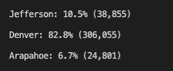

# Election_Analysis
--
## The purpose of this project is to assist Seth and Tom on the election commission. Do do this, we determined the voter turnout for each county, the percentage of votes from each county out of the total count, and the county wiht the highest turnout. The following will outline our process and our findings for the commission. 

### In the following bullet list will will display the election outcomes. 

* In this election, there were 369,712 votes cast
* The below image displays a breakdown of the number of votes and the percentage of total votes for each county in the precinct.
  

* As we can see, Denver county had the largest number of votes. 
 
* The below image displays a breakdown of the number of votes and the percentage of total votes for each candidate in the precinct.

* As we can see, Diana DeGette won the elections with 272,892 votes, which is 73.8% of the votes.

### In summary, the election commission can use this script for elections in other precincts. They could change the counties and use this script elsewhere. This could be done by adding a precinct field to the script then applying the script to any precinct. Another way the commission could modify this script for their benifit would be adding a city field so they could see the political leanings of each city in their precinct, not only the counties. 
